## 環境構築 (超簡単)
- repository clone
- readmeを参考にコマンド入力

## テスト方法
- docker 起動
- App 実行
- swagger UI 表示
- API実行

## フォルダ構成
<!--
- modules
  - presentation
    - controllers：RESTエンドポイントの定義、Request受信、Response送信
    - decorators：Swaggerデコレーション定義
    - dto
      - request：Requestパラメータの型定義、Validation
      - response：APIのReponse型定義、フォーマット
  - application
    - services：ビジネスロジックの調整
    - queries：CQRS実装（クエリオブジェクト・ハンドラー）
    - dto：アプリケーション内部で使用するデータ転送オブジェクト
  - domain
    - entities：ビジネスエンティティ定義
    - repositories：データアクセスのインターフェース定義
  - infrastructure
    - repositories：データベースアクセスの具体実装（Prisma）

- shared
  - constants：定数定義
  - enums：列挙型定義
  - types：TypeScript型定義
  - utils：汎用ユーティリティ関数
- core
  - exceptions：エラー処理定義
  - infrastructure
    - cache：cache処理
    - database：prisma
    - logging：ログ処理
  - presentation
    - guards：SiteContextをベースでアクセス、権限 validation確認
    - middleware：ミドルウェア処理
-->
詳細説明 [レイヤードアーキテクチャ構成ドキュメント](refer/layered-architecture-documentation.md)

#### modules
<table>
  <thead>
    <tr>
      <th>セクション</th>
      <th>要素</th>
      <th>説明</th>
    </tr>
  </thead>
  <tbody>
    <tr>
      <td rowspan="4">presentation</td>
      <td>controllers</td>
      <td>RESTエンドポイント定義、Request受信、Response送信</td>
    </tr>
    <tr>
      <td>decorators</td>
      <td>Swaggerデコレーション定義</td>
    </tr>
    <tr>
      <td>dto/request</td>
      <td>Requestパラメータ型定義・Validation</td>
    </tr>
    <tr>
      <td>dto/response</td>
      <td>API Response型定義・フォーマット</td>
    </tr>
    <tr>
      <td rowspan="3">application</td>
      <td>services</td>
      <td>ビジネスロジックの調整・ユースケース実装</td>
    </tr>
    <tr>
      <td>queries</td>
      <td>CQRS：クエリオブジェクト/ハンドラー</td>
    </tr>
    <tr>
      <td>dto</td>
      <td>アプリケーション内部DTO</td>
    </tr>
    <tr>
      <td rowspan="2">domain</td>
      <td>entities</td>
      <td>ビジネスエンティティ定義</td>
    </tr>
    <tr>
      <td>repositories</td>
      <td>データアクセスのインターフェース定義</td>
    </tr>
    <tr>
      <td>infrastructure</td>
      <td>repositories</td>
      <td>DBアクセスの具体実装（Prisma）</td>
    </tr>
  </tbody>
</table>

#### shared
<table>
  <thead>
    <tr>
      <th>要素</th>
      <th>説明</th>
    </tr>
  </thead>
  <tbody>
    <tr>
      <td>constants</td>
      <td>定数定義</td>
    </tr>
    <tr>
      <td>enums</td>
      <td>列挙型定義</td>
    </tr>
    <tr>
      <td>types</td>
      <td>TypeScript型定義</td>
    </tr>
    <tr>
      <td>utils</td>
      <td>汎用ユーティリティ関数</td>
    </tr>
  </tbody>
</table>

#### core
<table>
  <thead>
    <tr>
      <th>セクション</th>
      <th>要素</th>
      <th>説明</th>
    </tr>
  </thead>
  <tbody>
    <tr>
      <td></td>
      <td>exceptions</td>
      <td>エラー処理定義</td>
    </tr>
    <tr>
      <td rowspan="3">infrastructure</td>
      <td>cache</td>
      <td>キャッシュ処理</td>
    </tr>
    <tr>
      <td>database</td>
      <td>Prisma（DB）設定/アクセス</td>
    </tr>
    <tr>
      <td>logging</td>
      <td>ログ処理</td>
    </tr>
    <tr>
      <td rowspan="2">presentation</td>
      <td>guards</td>
      <td>SiteContextベースのアクセス/権限Validation</td>
    </tr>
    <tr>
      <td>middleware</td>
      <td>ミドルウェア処理</td>
    </tr>
  </tbody>
</table>

## APIが実行されるまでの流れ
<!--
- APIのエンドポイントにRequest
  - api/v1/company/banners
- Moduleから該当処理を探す
  - App Module
  - Banner Module
- 該当するControllerを探す
  - Banner Controller 
- Site Context Middleware 実行
  - サイト識別子確認
  - ユーザ認証確認
  - Site Context 構築
- Controller 実行
  - Request 確認
  - DTOからバリデーションチェック
  - Service側用Parameterに変換
  - Service呼び出し
- Service 実行
  - ビズネスロジック処理
  - DB Repository呼び出し
- Repository実行
  - DB処理
  - 結果をService層に返す
- ServiceからPresentation層に結果を返す
- Presentation層から結果を受け等
  - Responseを生成する
  - Responseを返す
-->
#### フロー図

```mermaid
flowchart TD
    Start([API Request Start])
    End([Response Return])
    
    A[API エンドポイント<br/>api/v1/company/banners]
    B[Module 検索]
    C[App Module<br/>Banner Module]
    D[Controller 検索<br/>Banner Controller]
    
    M[Site Context Middleware]
    M1[サイト識別子確認]
    M2[ユーザ認証確認]
    M3[Site Context 構築]
    
    E[Controller 実行]
    E1[Request 確認]
    E2[DTO バリデーション]
    E3[Service用 Parameter変換]
    
    F[Service 呼び出し]
    G[Service 実行]
    G1[ビジネスロジック処理]
    G2[Repository 呼び出し]
    
    H[Repository 実行]
    H1[DB 処理]
    H2[Service層に結果返却]
    
    I[Serviceから Presentationに返す]
    J[Presentation 処理]
    J1[Response 生成]
    
    Start --> A
    A --> B
    B --> C
    C --> D
    D --> M
    M --> M1
    M1 --> M2
    M2 --> M3
    M3 --> E
    E --> E1
    E1 --> E2
    E2 --> E3
    E3 --> F
    F --> G
    G --> G1
    G1 --> G2
    G2 --> H
    H --> H1
    H1 --> H2
    H2 --> I
    I --> J
    J --> J1
    J1 --> End
    
    style Start fill:#9C9B9A
    style End fill:#9C9B9A
    style M fill:#9C9B9A
    style E fill:#9C9B9A
    style G fill:#9C9B9A
    style H fill:#9C9B9A
```



## Cache処理

## エラーの処理
```typescript
throw new BadRequestException(
  `この${favoriteDivName}は既にお気に入りに登録されています`,
);

throw new InternalServerErrorException(
  'サービス一覧の取得中に予期しないエラーが発生しました',
);
```
詳細説明 [エラーハンドリング](2.exception-handling.md)