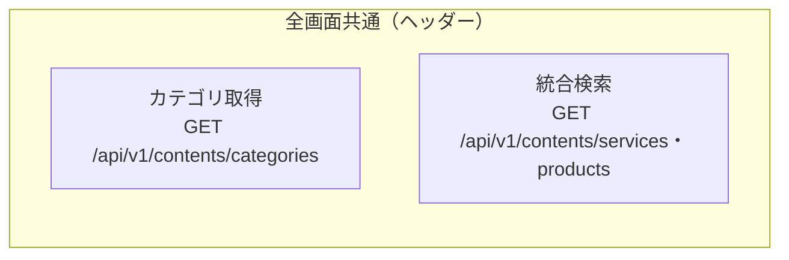
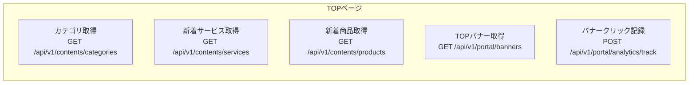
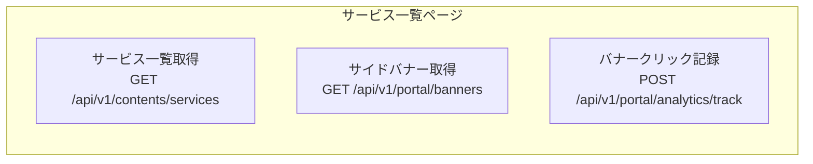
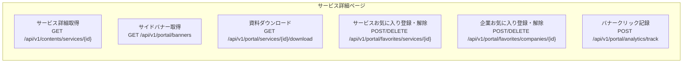
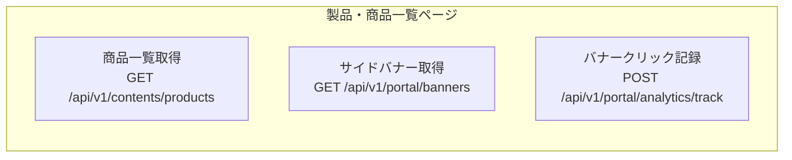
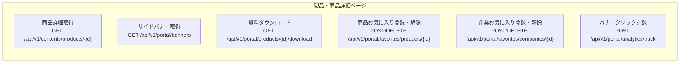

# 各画面のAPI呼び出し要件

## 概要

各画面を表示するために最低限必要なAPIと、各画面からのコールを想定して具体的なURL・パラメータをまとめました。
最後に、現状ある質問と進め方の予定を記載しております(改めてMTGや質問の機会を提案させてください)

## 全画面共通（ヘッダー）

### API一覧


### 必要な機能
- カテゴリ選択プルダウン（サービス・製品・商品）
- キーワード検索機能

### API呼び出し

**1. カテゴリプルダウン用データ取得**
```
GET /api/v1/contents/categories?type=service,product&depth=2
```
※ 大項目（level: 1）と中項目（level: 2）の両方が階層構造で取得可能

**2. 検索実行（サービス検索）**
```
GET /api/v1/contents/services?q={検索キーワード}
```
※ 大項目プルダウン選択でservicesAPIに切り替え、キーワード検索してサービス一覧ページに遷移

**2-a. 検索実行（商品検索）**
```
GET /api/v1/contents/products?q={検索キーワード}
```
※ 大項目プルダウン選択でproductsAPIに切り替え、キーワード検索して商品一覧ページに遷移

---

## TOPページ

### API一覧


### 必要な機能
- サービスをカテゴリから探す（中項目タイル表示）
- 製品・商品をカテゴリから探す（中項目タイル表示）
- 新着サービス一覧（5件）
- 新着製品・商品一覧（5件）
- TOPページ用バナー広告

### API呼び出し（ページ読み込み時に並列実行）

**1. カテゴリタイル表示用**
```
GET /api/v1/contents/categories?type=service,product&depth=2
```
※ サービスと商品のカテゴリ両方が取得可能

**2. 新着サービス表示用**
```
GET /api/v1/contents/services?sort=-created_at&per_page=5
```
※ -created_atで作成日の降順でソート、per_page=5で5件取得

**3. 新着商品表示用**
```
GET /api/v1/contents/products?sort=-created_at&per_page=5
```
※ -created_atで作成日の降順でソート、per_page=5で5件取得

**4. TOPバナー表示用**
```
GET /api/v1/portal/banners?screen=top
```
※ screen=topでTOPページに表示する全ての広告・バナーを一括取得
- メインカルーセル用（TOP001-010のposition_id）
- サイドバナー用（SID101-103, SID201-203, SID301-303のposition_id）
- サイドフローティング用（FRW101のposition_id）
- 各バナーの画像URL、リンク先URL、表示順序、切り替え時間などが全て含まれる

**5. バナークリック時の分析データ送信**
```
POST /api/v1/portal/analytics/track
```

> **⚠️ Warning**: 運用ケースを確認したうえで更新予定

---

## サービス一覧ページ

### API一覧


### 必要な機能
- サービス一覧（ページネーション・フィルター対応）
- サイドバナー広告（3個）
- フィルター機能（カテゴリ、並び順）

### API呼び出し（ページ読み込み時に並列実行）

**1. サービス一覧表示用**
```
GET /api/v1/contents/services?page=1&per_page=20
```
※ デフォルトで-created_at（作成日の降順・新しい順）でソート

**1-a. フィルター適用時**
```
GET /api/v1/contents/services?page=1&per_page=20&filter[category_id]={カテゴリID}&q={キーワード}
```
※ カテゴリ絞り込み（中項目としてバックエンドで自動判別） + キーワード検索の組み合わせ

**2. サイドバナー表示用**
```
GET /api/v1/portal/banners?screen=services
```
※ screen=servicesでサービス一覧ページのサイドバナーを取得
- サイドバナー用（SID101-103, SID201-203, SID301-303のposition_id）
- 各バナーの画像URL、リンク先URL、表示順序などが含まれる

### ユーザー操作時のAPI呼び出し

**3. 一括資料ダウンロード**
```
POST /api/v1/portal/services/batch-download
```
- ログイン必須
- リクエストボディでサービスID配列を送信（例：{"serviceIds": ["ESV1234567", "ESV1234568"]}）
- API内部で共通トラッキング関数を呼び出し、一括ダウンロード行動を自動記録

**4. バナークリック時の分析データ送信**
```
POST /api/v1/portal/analytics/track
```

> **⚠️ Warning**: 運用ケースを確認したうえで更新予定

---

## サービス詳細ページ

### API一覧


### 必要な機能
- サービス詳細情報（基本情報・画像・セクション・企業情報）
- 資料ダウンロードボタン（ログイン必須）
- サービスお気に入り登録・解除ボタン（ログイン必須）
- 企業お気に入り登録・解除ボタン（ログイン必須）
- 企業問い合わせボタン（メーラー立ち上げ）
- サイドバナー広告（3個）

### API呼び出し（ページ読み込み時に並列実行）

**1. サービス詳細情報表示用**
```
GET /api/v1/contents/services/{id}
```
※ API内部で共通トラッキング関数を呼び出し、PV数（view）を自動記録

**2. サイドバナー表示用**
```
GET /api/v1/portal/banners?screen=services
```

### ユーザー操作時のAPI呼び出し

**3. 資料ダウンロード**
```
GET /api/v1/portal/services/{id}/download
```
※ ログイン必須、API内部で共通トラッキング関数を呼び出し、ダウンロード行動を自動記録

**4. サービスお気に入り登録**
```
POST /api/v1/portal/services/{id}/favorite
```
※ ログイン必須、API内部で共通トラッキング関数を呼び出し、お気に入り行動を自動記録

**5. サービスお気に入り解除**
```
DELETE /api/v1/portal/services/{id}/favorite
```
※ ログイン必須、API内部で共通トラッキング関数（カウントダウン）を呼び出し、お気に入り解除行動を自動記録

**6. 企業お気に入り登録**
```
POST /api/v1/portal/companies/{id}/favorite
```
※ ログイン必須、API内部で共通トラッキング関数を呼び出し、企業お気に入り行動を自動記録

**7. 企業お気に入り解除**
```
DELETE /api/v1/portal/companies/{id}/favorite
```
※ ログイン必須、API内部で共通トラッキング関数（カウントダウン）を呼び出し、企業お気に入り解除行動を自動記録

**8. 企業問い合わせ**
※ サービス詳細APIのレスポンスに含まれる企業メールアドレスを使用してフロント側でメーラーを立ち上げ（APIコールなし）

**9. バナークリック時の分析データ送信**
```
POST /api/v1/portal/analytics/track
```

> **⚠️ Warning**: 運用ケースを確認したうえで更新予定

---

## 製品・商品一覧ページ

### API一覧


### 必要な機能
- 商品一覧（ページネーション・フィルター対応）
- サイドバナー広告（3個）
- フィルター機能（カテゴリ、並び順）

### API呼び出し（ページ読み込み時に並列実行）

**1. 商品一覧表示用**
```
GET /api/v1/contents/products?page=1&per_page=20
```
※ デフォルトで-created_at（作成日の降順・新しい順）でソート

**1-a. フィルター適用時**
```
GET /api/v1/contents/products?page=1&per_page=20&filter[category_id]={カテゴリID}&q={キーワード}
```
※ カテゴリ絞り込み（中項目としてバックエンドで自動判別） + キーワード検索の組み合わせ

**2. サイドバナー表示用**
```
GET /api/v1/portal/banners?screen=products
```
※ screen=productsで商品一覧ページのサイドバナーを取得
- サイドバナー用（SID101-103, SID201-203, SID301-303のposition_id）
- 各バナーの画像URL、リンク先URL、表示順序などが含まれる

### ユーザー操作時のAPI呼び出し

**3. 一括資料ダウンロード**
```
POST /api/v1/portal/products/batch-download
```
- ログイン必須
- リクエストボディで商品ID配列を送信（例：{"productIds": ["EPD1234567", "EPD1234568"]}）
- API内部で共通トラッキング関数を呼び出し、一括ダウンロード行動を自動記録

**4. バナークリック時の分析データ送信**
```
POST /api/v1/portal/analytics/track
```

> **⚠️ Warning**: 運用ケースを確認したうえで更新予定

---

## 製品・商品詳細ページ

### API一覧


### 必要な機能
- 商品詳細情報（基本情報・画像・セクション・企業情報）
- 資料ダウンロードボタン（ログイン必須）
- 商品お気に入り登録・解除ボタン（ログイン必須）
- 企業お気に入り登録・解除ボタン（ログイン必須）
- 企業問い合わせボタン（メーラー立ち上げ）
- サイドバナー広告（3個）

### API呼び出し（ページ読み込み時に並列実行）

**1. 商品詳細情報表示用**
```
GET /api/v1/contents/products/{id}
```
※ API内部で共通トラッキング関数を呼び出し、PV数（view）を自動記録

**2. サイドバナー表示用**
```
GET /api/v1/portal/banners?screen=products
```

### ユーザー操作時のAPI呼び出し

**3. 資料ダウンロード**
```
GET /api/v1/portal/products/{id}/download
```
※ ログイン必須、API内部で共通トラッキング関数を呼び出し、ダウンロード行動を自動記録

**4. 商品お気に入り登録**
```
POST /api/v1/portal/items/{id}/favorite
```
※ ログイン必須、API内部で共通トラッキング関数を呼び出し、お気に入り行動を自動記録

**5. 商品お気に入り解除**
```
DELETE /api/v1/portal/items/{id}/favorite
```
※ ログイン必須、API内部で共通トラッキング関数（カウントダウン）を呼び出し、お気に入り解除行動を自動記録

**6. 企業お気に入り登録**
```
POST /api/v1/portal/companies/{id}/favorite
```
※ ログイン必須、API内部で共通トラッキング関数を呼び出し、企業お気に入り行動を自動記録

**7. 企業お気に入り解除**
```
DELETE /api/v1/portal/companies/{id}/favorite
```
※ ログイン必須、API内部で共通トラッキング関数（カウントダウン）を呼び出し、企業お気に入り解除行動を自動記録

**8. 企業問い合わせ**
※ 商品詳細APIのレスポンスに含まれる企業メールアドレスを使用してフロント側でメーラーを立ち上げ（APIコールなし）

**9. バナークリック時の分析データ送信**
```
POST /api/v1/portal/analytics/track
```


## 会員マイページ／マイページTOPページ
**1. お気に入りサービス取得**
```
GET /api/v1/portal/favorites/services
```

**2. お気に入り製品・商品取得**
```
GET /api/v1/portal/favorites/items
```

**3. お気に入り企業取得**
```
GET /api/v1/portal/favorites/companies
```

## 会員マイページ／マイサービスページ
**1. お気に入りサービス取得**
```
GET /api/v1/portal/favorites/services
```

**2. お気に入りサービス削除**
```
DELETE /api/v1/portal/services/{id}/favorite
```

## 会員マイページ／マイ製品・商品ページ
**1. お気に入り製品・商品取得**
```
GET /api/v1/portal/favorites/items
```

**2. お気に入り製品・商品削除**
```
DELETE /api/v1/portal/items/{id}/favorite
```

## 会員マイページ／マイ企業ページ
**1. お気に入り企業取得**
```
GET /api/v1/portal/favorites/companies
```

**2. お気に入り企業削除**
```
DELETE /api/v1/portal/companies/{id}/favorite
```

## 会員マイページ／登録会員情報ページ
**1. 会員情報取得**
```
GET /portal/members/profile
```

**2. 会員情報更新**
```
PUT /portal/members/profile
```

> **⚠️ Warning**: 運用ケースを確認したうえで更新予定

---

## サービス実現に必要なAPI概要

### 必要なAPI総数：12個

**コンテンツ系API（4個）**：
- `GET /api/v1/contents/categories` - カテゴリマスタ取得
- `GET /api/v1/contents/services` - サービス一覧・検索
- `GET /api/v1/contents/products` - 商品一覧・検索
- `GET /api/v1/contents/services/{id}` と `GET /api/v1/contents/products/{id}` - 詳細取得

**ポータル系API（4個）**：
- `GET /api/v1/portal/banners` - バナー表示
- `GET /api/v1/portal/services/{id}/download` と `GET /api/v1/portal/products/{id}/download` - 資料ダウンロード
- `POST /api/v1/portal/services/batch-download` と `POST /api/v1/portal/products/batch-download` - 一括資料ダウンロード
- `POST /api/v1/portal/analytics/track` - 分析データ収集

**お気に入り系API（9個）**：
- `GET /api/v1/portal/favorites/services/` - サービスお気に入り取得
- `POST /api/v1/portal/services/{id}/favorite` - サービスお気に入り登録
- `DELETE /api/v1/portal/services/{id}/favorite` - サービスお気に入り削除

- `GET /api/v1/portal/favorites/items` - 商品お気に入り取得
- `POST /api/v1/portal/items/{id}/favorite` - 商品お気に入り登録
- `DELETE /api/v1/portal/items/{id}/favorite` - 商品お気に入り削除

- `GET /api/v1/portal/favorites/companies` - 企業お気に入り取得
- `POST /api/v1/portal/companies/{id}/favorite` - 企業お気に入り登録
- `DELETE /api/v1/portal/companies/{id}/favorite` - 企業お気に入り削除

**会員情報API（2個）**：
- `GET /portal/members/profile` - 会員情報取得
- `PUT /portal/members/profile` - 会員情報更新

### 実装順序

1. **サービス一覧API** - ✅ 既に実装済み
2. **製品・商品一覧API** - 次に実装予定
3. **サービス詳細API** - 続いて実装
4. **商品詳細API** - 続いて実装
5. **その他のAPI** - 作業可能なところから順次実装

- 上記の順番で順序で実装を進める予定です
- 共通化可能なものに関しては共通関数で実装予定
- yamlの修正が必要な場合は都度対応
- DBテーブルが必要な場合、修正が必要な場合は田原さんに依頼予定
- DL機能やメール(実装する場合)はS3箇所だけはインフラ作成後の対応

## 重要な注意事項

### 認証について
- **未ログイン**: 全画面の表示系API（GET）は利用可能
- **ログイン必須**: お気に入り登録API、資料ダウンロードAPI系

### アクセス制限について
- 共通または、Portalのみで利用するAPIはyamlのディレクトリで判断
- バックエンド実装時に考慮して作成する

### yamlはあくまで全ての情報のパターンを記載(呼ばれた箇所に応じて含まれる情報は変動)
- 例えば、アクセス数などはユーザー側へのレスポンスでは含まないなど

---

## 確認が必要な項目

### バナー運用
- 運用ケースが見えないため、第一フェーズ時の運用と展望について改めて共有いただきたいです
- 集計ロジックも場合に応じて修正予定

### メール処理の有無
- ユーザー操作のあとに通知メールが発生する処理は存在するのか
- 企業問い合わせに関してはバックエンド側でメール送信の処理は作成しない認識で良いか

### トラッキングに関して
- PV数の集計などの制御の基準を共有いただきたいです
- 同じユーザーからのPV・DL数などをどのように処理すべきか

### TOP専用のAPIを作成するかどうか
- 呼ばれるAPIの数が多いため、1つの専用APIを設けるかどうか

### yamlのレビューに関して
- エンドポイントの確認だけお願いします
- 特に下記2つは確認いただけると幸いです
- specs/openapi/v1/contents/categories.yamlはcontents直下で良いか
- specs/openapi/v1/portal/analytics.yamlはバナー専用なのでportal/analytics/bannersとかのほうが良いか
※ あとは仕様書通りなので問題ない認識でいますが、修正必要であれば指摘いただけますと幸いです

---